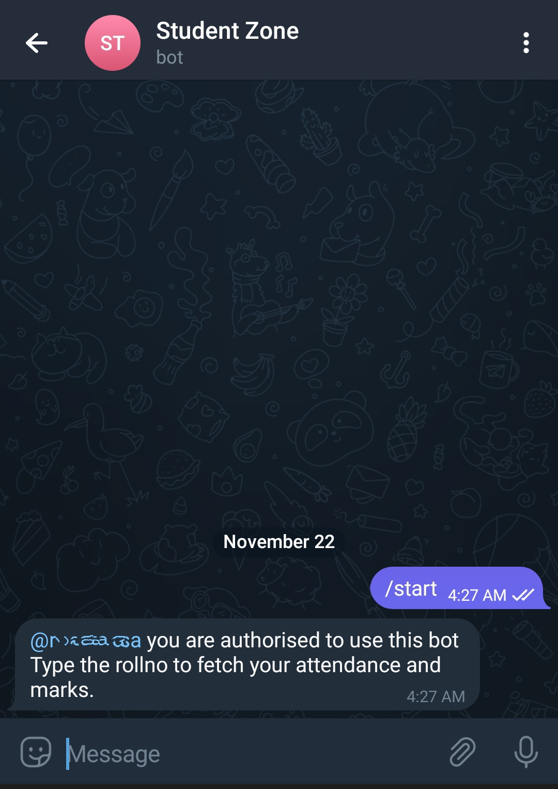
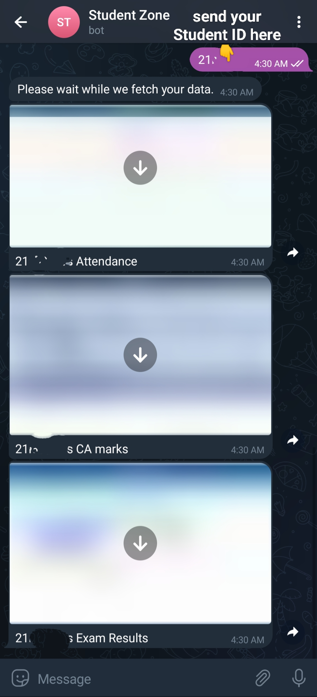

# Telegram Bot for PSGTECH Student Zone
Simple Telegram Bot to fetch student's Attandance, CA marks and Semester results from [PSGTech](https://ecampus.psgtech.ac.in/studzone2/) website.

#Index
1. [Specifications](#Specifications)
2. [Usage](#usage)
    - [Steps to deploy on Heroku](#steps-to-deploy-on-heroku)
    - [Structure of config.json](#structure-of-configjson)
3. [Commands](#commands)
4. [Screenshots](#screenshots)
5. [License](#license)
6. [Contributing](#contributing)


## Specifications
- The bot is hosted on [Heroku](https://www.heroku.com/) and uses Python Telegram Bot API to interact with Telegram.
- The bot is written in Python 3.6 and uses [Selenium](https://www.seleniumhq.org/) to scrape the website.
- The bot is deployed on Heroku using [Heroku Buildpack for Google Chrome](https://github.com/heroku/heroku-buildpack-google-chrome) and [Heroku Buildpack for Chromedriver](https://github.com/heroku/heroku-buildpack-chromedriver).

## Usage
- The bot can fetch the following details:
  - Attendance
  - CA Marks
  - Semester Results
- This bot can only be used by students of PSG Tech. It will not work for any other college.
- You have to fork this repository and deploy it on [Heroku](https://www.heroku.com/) or any other platform. You should also create a config.json file in the root directory of the repository.
- The config.json file should contains the Bot token, student credentials and the users allowed to use the bot. The format is mentioned below.
- Cloudinary is used to store the images. You can create an add-on for cloudinary (if you use heroku) and add the cloud name, api key and api secret to the config.json file.

### Steps to deploy on Heroku
1. Create a bot using [@BotFather](https://t.me/BotFather)
2. Create a config.json file in the root directory of the repository. The format is mentioned below.
3. Fork this repository and deploy it on Heroku or any other platform.
4. Get the token from [@BotFather](https://t.me/BotFather) and add it in the config file.
5. Add Environment Variables and Buildpack in Heroku. The variables are mentioned in the heroku_config.png file.
6. Also, Add the config.json file as an environment variable in Heroku.
    - Name of the variable: CONFIG
    - Value of the variable: The contents of the config.json file
7. Start the bot and use it.

#### Structure of config.json
```json
{
    "token": "YOUR_TOKEN",
    "allowedusers":["YOUR_TELEGRAM_ID", "OTHER_ALLOWED_USERS"],
    "cloudinary": {
        "cloud_name" : "YOUR_CLOUD_NAME",
        "api_key" : "YOUR_API_KEY",
        "api_secret" : "YOUR_API_SECRET"
    },
    "student_credentials": {"YOUR_ROLLNO" : "YOUR_PASSWORD", "YOUR_ROLLNO_2" : "YOUR_PASSWORD"}
}
```

- `token` is the token you get from [@BotFather](https://t.me/BotFather)
- `allowedusers` is the list of telegram ids of the users who are allowed to use the bot
- `cloudinary` is the cloudinary credentials to upload the images to cloudinary
- `student_credentials` is the dictionary of rollno and password of the students

## Commands
1. `/start` - Start the bot
2. `rollno` - Enter the roll number to get the attendance, CA marks and semester exam results

## Screenshots
Send `/start` command to check if the bot is working.


If the bot works try sending your `rollno` to get the details.


## License
The code is free to use and modify. The code is licensed under [MIT License](https://choosealicense.com/licenses/mit/).

## Contributing
Feel free to open an issue or a pull request if you find any bugs or want to add any features.